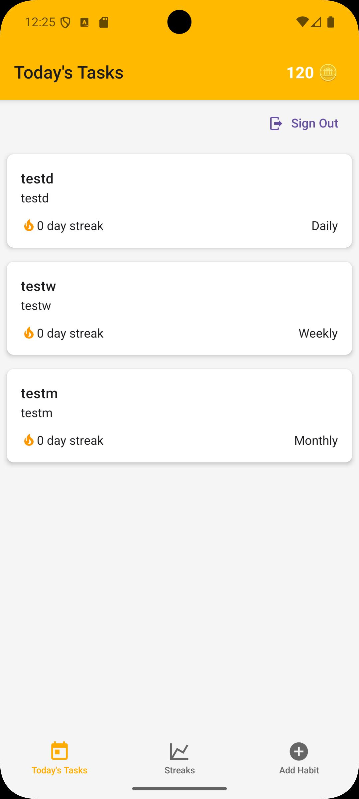
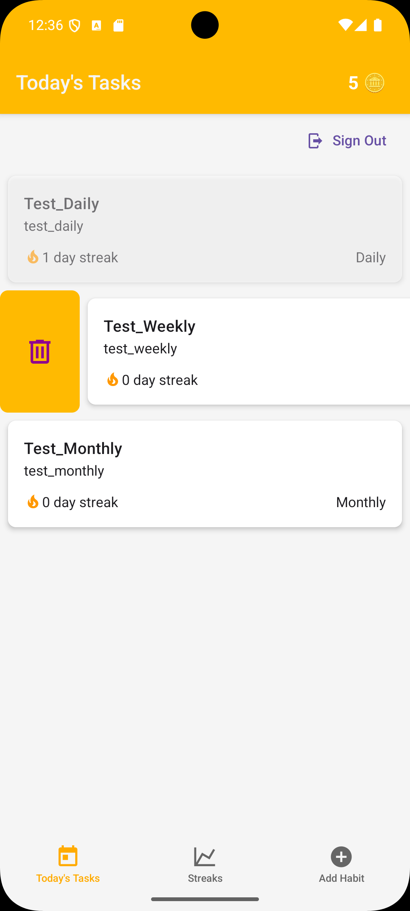
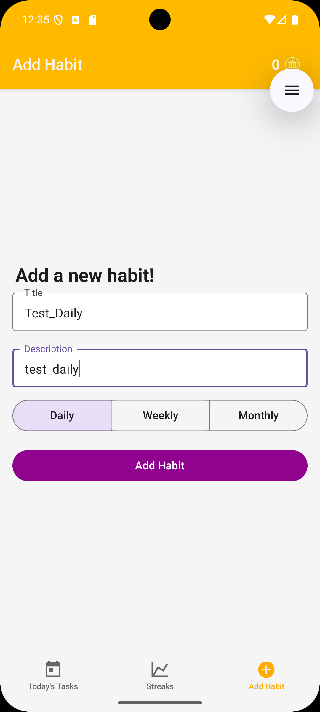
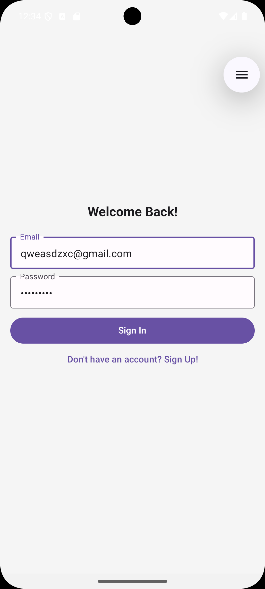
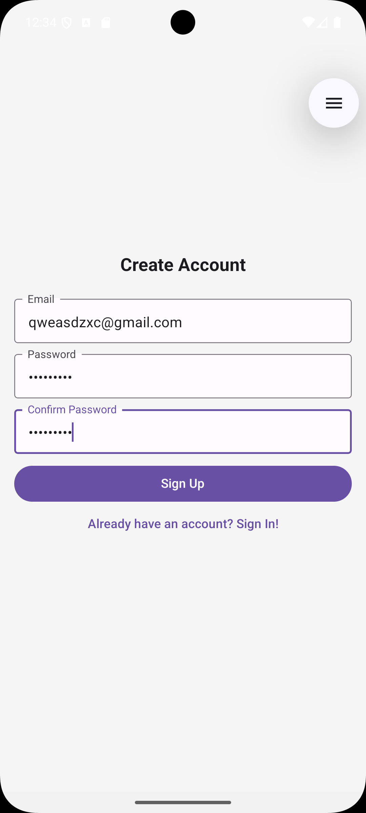

# 🧠 Dragon Tracker

[tr] Alışkanlıklarını takip et, streak'lerini koru, motivasyonunu artır!  
Dragon Tracker; günlük, haftalık ve aylık alışkanlıklarını yönetmeni sağlayan, gamification destekli bir mobil uygulamadır.

[eng] Track your habits, maintain your streaks, and boost your motivation!  
Dragon Tracker is a mobile app designed to help you manage your daily, weekly, and monthly habits with gamification and instant feedback.

---

## 📱 Ekran Görüntüleri / Screenshots

| ✅ Habit Completion | 🔥 Streak Tracking | ➕ Add New Habit |
|-------------------|------------------|----------------------|
|  |  |  |

| 🔐 Giriş Ekranı | 🆕 Kayıt Ekranı |
| 🔐 Sign In | 🆕 Sign Up |
|----------------|----------------|
|  |  |

---

## 🚀 Özellikler / Features

[tr]
- Swipe hareketleriyle alışkanlık tamamlama ve silme  
- Frekansa göre kilitlenme mantığı (daily / weekly / monthly)  
- Coin kazanımı ve streak sistemi  
- Ses efektleriyle anlık geri bildirim  
- Appwrite ile güvenli oturum ve veri yönetimi  
- Expo Router ile modüler sayfa yapısı  
- EAS Build ile kolay dağıtım

[eng]
- Swipe gestures to complete or delete habits  
- Lock logic based on habit frequency (daily / weekly / monthly)  
- Coin rewards and streak tracking  
- Sound effects for instant feedback  
- Secure authentication and data management via Appwrite  
- Modular page structure with Expo Router  
- Easy distribution with EAS Build
---

## 📥 APK İndir / Download 
👉 [HabitTracker APK İndir](https://drive.google.com/file/d/12Q-Hw8EfPsz2hxhV5Kg1kXhRjddhtCdG/view?usp=sharing)

---

## 🧪 Teknolojiler / Technologies
React Native + Expo
TypeScript
Appwrite (Auth + Database)
React Native Paper
Expo Router
EAS Build

---

## 🛠️ Kurulum / Installation

```bash
git clone https://github.com/kutaydem/HabitTracker.git
cd HabitTracker
npm install
npx expo start


